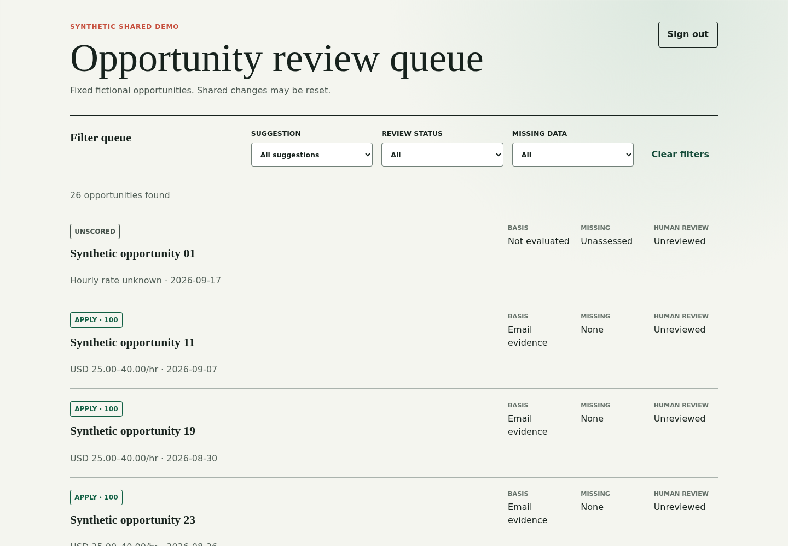
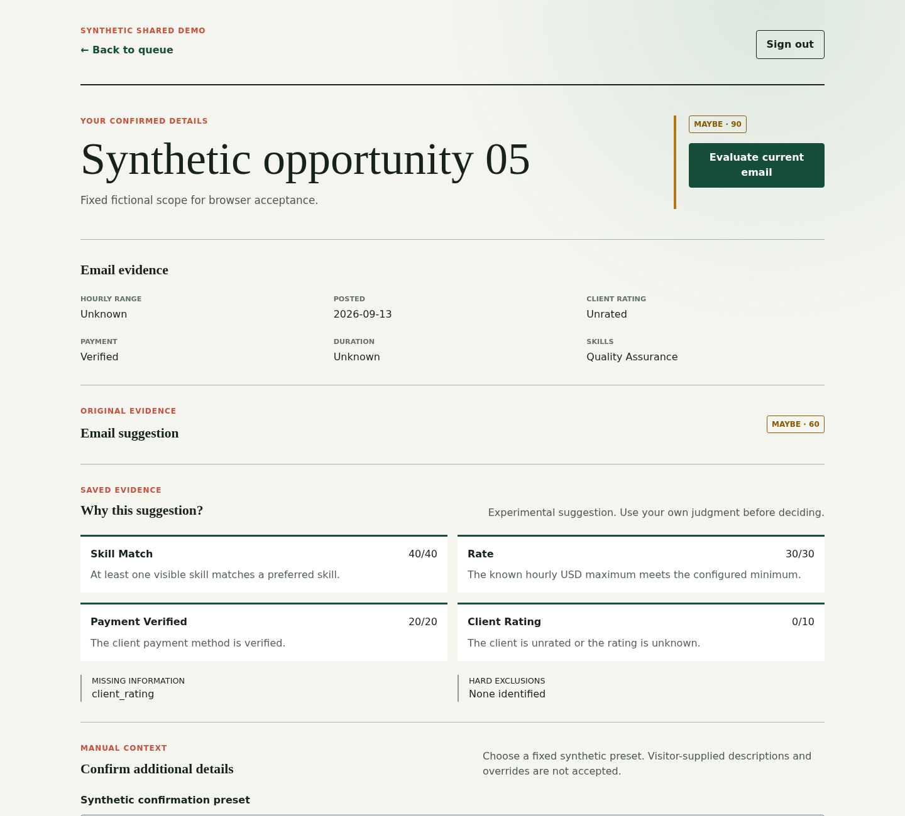
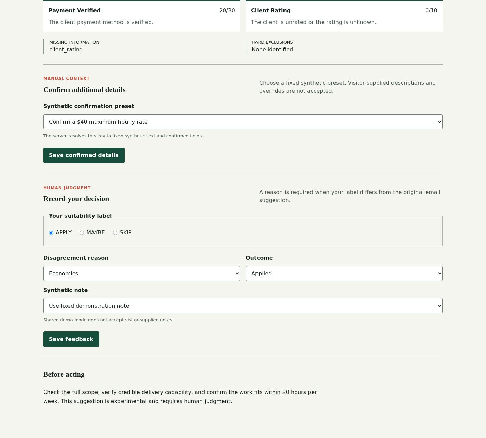

# Portfolio Demonstration

This is a synthetic engineering demonstration, not a proven opportunity-discovery product. Run it locally using the [clean-checkout instructions](../../README.md#synthetic-demo-from-a-clean-checkout). The fixed seeder creates two workspaces, two users and 28 fictional opportunities (26 in the entered workspace); the queue paginates at 25. No mailbox or marketplace credentials are needed. The public demo URL will be added only after an approved deployment is verified.

## Architecture and boundaries

For private use, an authorized dedicated mailbox is polled through the replaceable `MailboxClient` binding; a UID checkpoint and message ledger track delivery. `ImportOpportunityEmail` passes raw RFC822 bytes in memory to `OpportunityEmailParser::parse(string $rawEmail): ParsedOpportunity`, which `AppServiceProvider` binds to `UpworkJobAlertParser`. The readonly `ParsedOpportunity` carries normalized fields and explicit nullable unknowns. The importer owns workspace-scoped persistence, identity-based idempotency, and safe quarantine metadata; it does not store raw bodies or tracking URLs. Saved, deterministic evaluations and human reviews are separate records. The authenticated dashboard derives its workspace from the user's assignment and displays the current saved suggestion, never silently re-scores on a read.

In demo mode, the fixed `ReviewDemoSeeder` populates a separate disposable `_demo` database; `/demo` enters the fixed user and preset-only enrichment. Mailbox intake is disabled. The private account, personal scoring profile, genuine reviews and mailbox credentials never belong in this database or in public evidence. Automated browser tests use a different `_test` database which they recreate. See [scheduled IMAP polling](adr/ADR-004-scheduled-imap-polling.md), [deterministic triage](adr/ADR-005-deterministic-opportunity-triage.md), [review dashboard](adr/ADR-007-review-dashboard-and-manual-enrichment.md), and the [review operations runbook](runbooks/phase4-review-dashboard.md).

## Threat model

| Asset / boundary            | Threat                                    | Implemented control                                                                                                                          | Verification                                                                                                                          | Residual limitation                                                                                           |
| --------------------------- | ----------------------------------------- | -------------------------------------------------------------------------------------------------------------------------------------------- | ------------------------------------------------------------------------------------------------------------------------------------- | ------------------------------------------------------------------------------------------------------------- |
| Raw email / parser          | Malformed or oversized MIME, unsafe links | 1 MiB guard, exact sender/template checks, canonical URL normalization, safe quarantine codes                                                | `UpworkJobAlertParserTest`, `ImportOpportunityEmailTest`                                                                              | Only observed hourly templates are supported; authorized IMAP access still depends on operator configuration. |
| Stored and displayed text   | Script-like user or email text            | Plain-text rendering and validated write limits                                                                                              | `ReviewInputSafetyTest`, browser script-probe journey                                                                                 | Human review is still needed before sharing screenshots or text.                                              |
| Session and writes          | Unauthorized entry or forged write        | Session authentication, CSRF protection, demo preset allowlist                                                                               | `ReviewAuthenticationTest`, `ReviewDemoTest`, browser forged-write check                                                              | Public demo is a shared synthetic session, not private storage.                                               |
| Workspace ownership         | Cross-workspace reads or writes           | User-derived workspace and scoped lookup returning 404                                                                                       | `ReviewWorkspaceIsolationTest`, demo foreign-detail smoke                                                                             | Operator must provision the correct workspace assignment.                                                     |
| Private and demo databases  | Accidental private data in a demo         | Separate `_demo` volume, guarded seeder, disabled mailbox                                                                                    | [Committed-checkout local smoke](../../README.md#slice-1-verification-2026-09-23); host acceptance pending                            | Migration commands are destructive if pointed at the wrong database; verify connection first.                 |
| Secrets, history and assets | Publishing unrecognized private material  | Ignored real env files and private profiles; full-history secret scan; prepublication human review of fixtures, docs, screenshots and assets | `Secret scan` CI plus [bounded Slice 1 human review](../../README.md#slice-1-verification-2026-09-23); final candidate review pending | Scanning cannot prove absence of private data. Stop publication and seek a remediation decision if found.     |
| Dependencies and release    | Changed or unverified artifact            | Locked installs and required checks; candidate SBOM, hashes and manual release gate specified for Phase 5                                    | CI and release evidence (pending)                                                                                                     | No candidate or publication is claimed until verification completes.                                          |

## Future source boundary

The parser, `ParsedOpportunity`, binding and import action are **email-specific**, not a generic provider framework. Any API adapter needs a separate ADR/specification that addresses documented authorization for its intended access method, a stable provider and external ID, explicit unknowns and provenance, safe canonical links, workspace-owned persistence and deduplication, replaceable transport, sanitized fixtures, and failure/no-network contract tests. Email `Message-ID` and content-hash identity, MIME/sender assumptions, hourly-template fields, tracking-link rejection and the mailbox UID ledger cannot simply be reused as an API contract. There is no general API interface, registry or marketplace connector today.

## Evidence and limits

The first real calibration has status `READY`, 30 reviewed imports, a 3.33% machine skip rate, a 9.09% false-negative rate and `targets_met=false`. It does not establish time savings, feasibility GO, commercial usefulness or marketplace-wide coverage. Synthetic feedback is not calibration evidence. See the [Slice 1 verification and bounded human review](../../README.md#slice-1-verification-2026-09-23) and [Phase 4 target-host acceptance record](runbooks/phase4-review-dashboard.md#completion-record). Final operator privacy review of exact release assets, candidate verification, host acceptance, rollback rehearsal and release evidence remain pending before publication.
